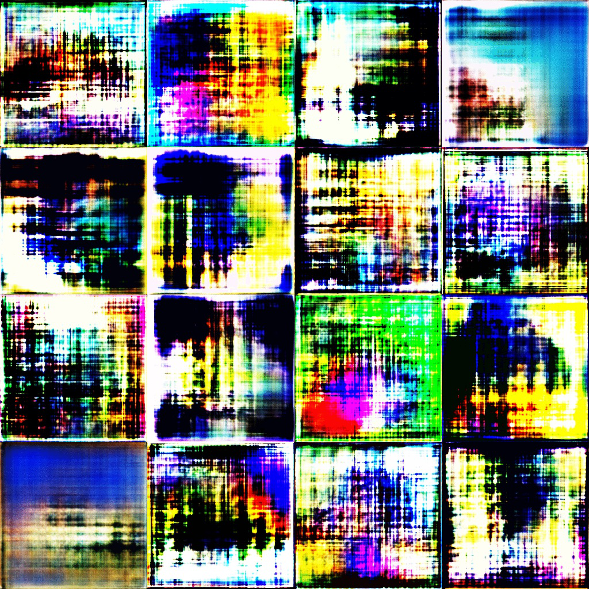
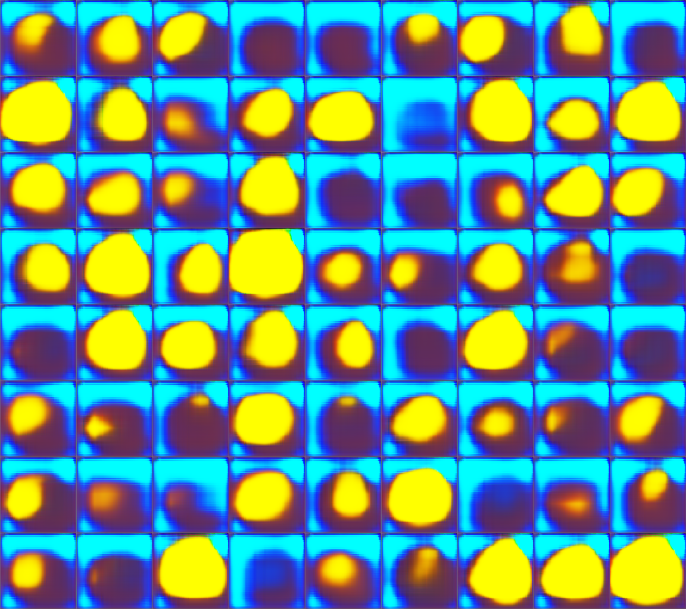
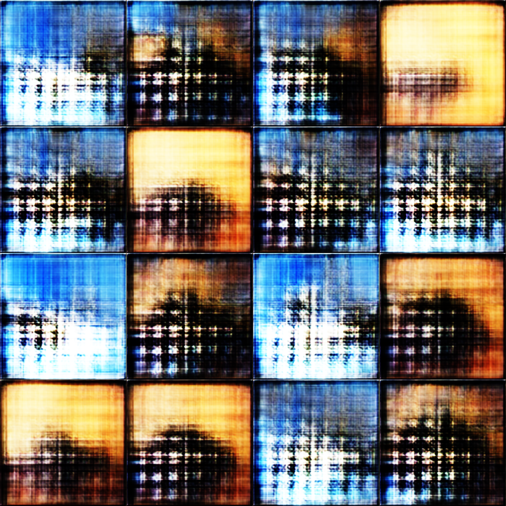
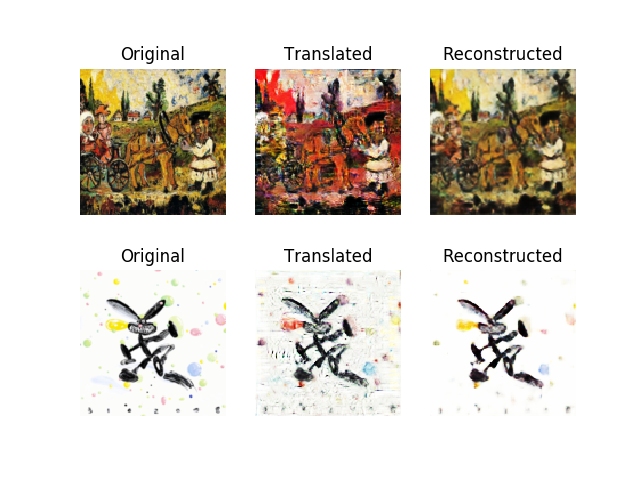
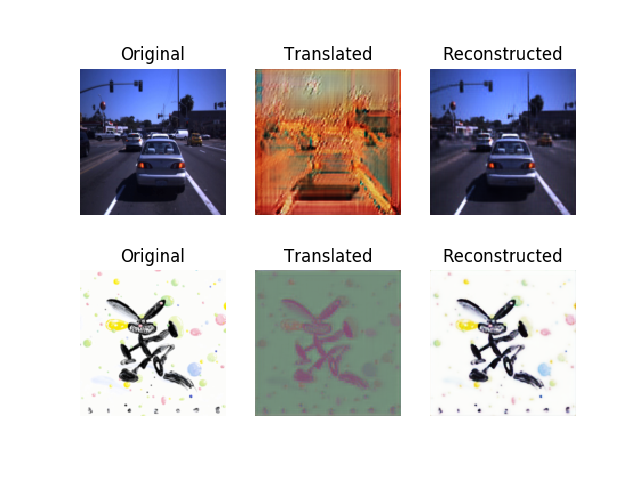
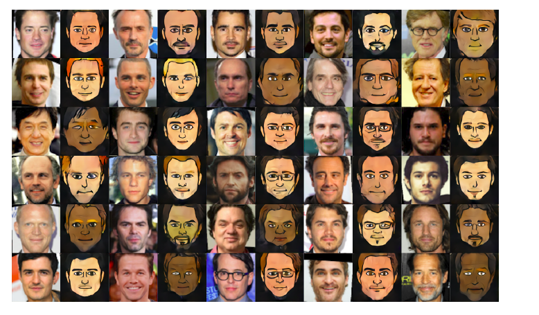

# Orama CAN 
Orama CAN is a project that aims to make use of a type of deep learning model: CAN 
(Creative Adversarial Network) to generate original images by combining different 
styles of training images. Below is an example:

Samples from CAN after 80-100 epoch. Each epoch is roughly of 40 hours' running time on a supercomputer.  

5 Epoch  

80 Epoch  

## GAN
CycleGAN Style transfer: each style is trained with around 1500 images 
Ouput shown as translated, reversion process shown as reconstructed 

Classicism to pop art, 200 epoch.  

Dashcam to pop art, 145 epoch.  

Dashcam to pop art, compilation.  

Photo to cartoon.  

